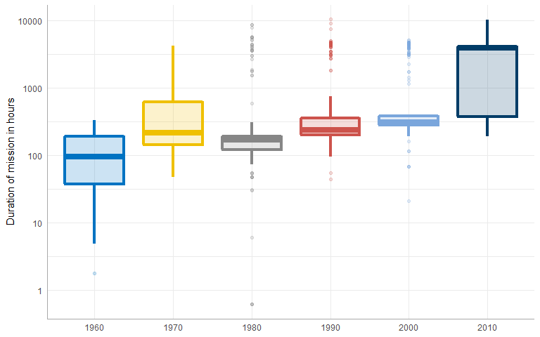
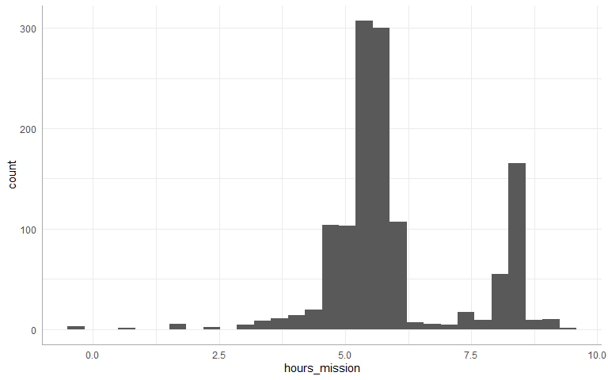
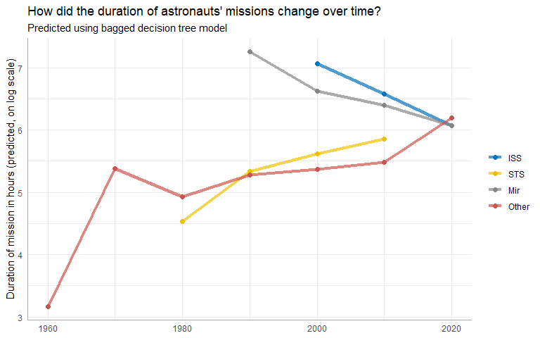
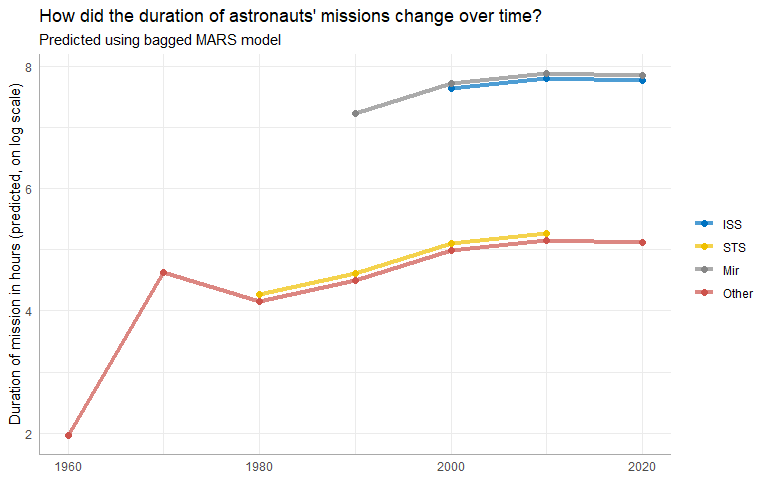
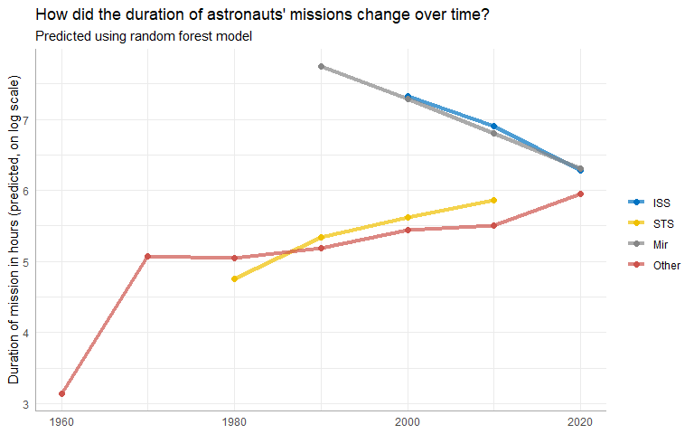
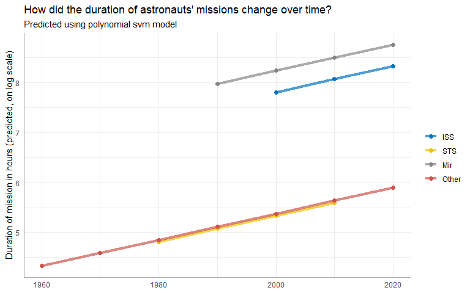

Tidy Tuesday - Astronaut Missions
================
Matthew Wilson
09 November, 2020

#### Necessary package and themes

``` r
library(tidyverse)
library(tidymodels)
library(skimr)
library(janitor)
library(corrr)
library(vip)
library(visdat)
library(reticulate)

pal <- c("#0073C2FF","#EFC000FF","#868686FF","#CD534CFF","#7AA6DCFF",
         "#003C67FF","#8F7700FF","#3B3B3BFF","#A73030FF","#4A6990FF")

theme_set(theme_minimal())
theme_update(axis.line.x = element_line(color="dark grey"),
             axis.line.y = element_line(color="dark grey"))
```

### Summary of objective

Building boostrap models using a \#TidayTuesday dataset with astronaut
missions.

**Predict** `duration` in space

For this analysis, we are going to build a bagging, i.e. bootstrap
aggregating, model. This is an ensembling and model averaging method
that:

– improves accuracy and stability – reduces overfitting and variance

In tidymodels, you can create bagging ensemble models with baguette, a
parsnip-adjacent package. The baguette functions create new bootstrap
training sets by sampling with replacement and then fit a model to each
new training set. These models are combined by averaging the predictions
for the regression case, like what we have here (by voting, for
classification).

#### Loading the dataset

``` r
astronauts <- read_csv("https://raw.githubusercontent.com/rfordatascience/tidytuesday/master/data/2020/2020-07-14/astronauts.csv")

astronauts %>%
  count(in_orbit, sort = TRUE)
```

    ## # A tibble: 289 x 2
    ##    in_orbit      n
    ##    <chr>     <int>
    ##  1 ISS         174
    ##  2 Mir          71
    ##  3 Salyut 6     24
    ##  4 Salyut 7     24
    ##  5 STS-42        8
    ##  6 explosion     7
    ##  7 STS-103       7
    ##  8 STS-107       7
    ##  9 STS-109       7
    ## 10 STS-110       7
    ## # ... with 279 more rows

``` r
astronauts %>%
  mutate(
    year_of_mission = 10 * (year_of_mission %/% 10),
    year_of_mission = factor(year_of_mission)) %>%
  ggplot(aes(year_of_mission, hours_mission,
    fill = year_of_mission, color = year_of_mission)) +
  geom_boxplot(alpha = 0.2, size = 1.5, show.legend = FALSE) +
  scale_y_log10() +
  scale_color_manual(values = pal)+ scale_fill_manual(values = pal)+
  labs(x = NULL, y = "Duration of mission in hours")
```

    ## Warning: Transformation introduced infinite values in continuous y-axis

    ## Warning: Removed 6 rows containing non-finite values (stat_boxplot).

<!-- -->

``` r
astronauts_df <- astronauts %>%
  select(
    name, mission_title, hours_mission,
    military_civilian, occupation, year_of_mission, in_orbit
  ) %>%
  mutate(
    in_orbit = case_when(
      str_detect(in_orbit, "^Salyut") ~ "Salyut",
      str_detect(in_orbit, "^STS") ~ "STS",
      TRUE ~ in_orbit
    ),
    occupation = str_to_lower(occupation)
  ) %>%
  filter(hours_mission > 0) %>%
  mutate(hours_mission = log(hours_mission)) %>%
  na.omit()

ggplot(astronauts_df, aes(hours_mission))+
  geom_histogram()
```

<!-- -->

#### Split into test and train datasets

``` r
data_split <- initial_split(astronauts_df, strata = hours_mission)
X_train <- training(data_split)
X_test <- testing(data_split)
```

#### Preprocessing steps

``` r
astro_recipe <- 
  recipe(hours_mission ~ ., data = X_train) %>%
  update_role(name, mission_title, new_role = 'id') %>% 
  step_other(occupation, in_orbit,
      threshold = 0.005, other = 'Other') %>%
  step_dummy(all_nominal(), -has_role('id'))
```

``` r
astro_recipe %>% 
  prep() %>% 
  juice() %>% 
  names()
```

    ##  [1] "name"                             "mission_title"                   
    ##  [3] "year_of_mission"                  "hours_mission"                   
    ##  [5] "military_civilian_military"       "occupation_flight.engineer"      
    ##  [7] "occupation_msp"                   "occupation_other..space.tourist."
    ##  [9] "occupation_pilot"                 "occupation_psp"                  
    ## [11] "occupation_Other"                 "in_orbit_Mir"                    
    ## [13] "in_orbit_Salyut"                  "in_orbit_STS"                    
    ## [15] "in_orbit_Other"

#### Workflow

This allows us to pass process and prep in one step

``` r
boost_wf <-
  workflow() %>% 
  add_recipe(astro_recipe)
```

#### Model Specifications

``` r
library(baguette)

tree_spec <-
  bag_tree() %>% 
  set_engine('rpart', times = 25) %>% 
  set_mode('regression')

tree_spec
```

    ## Bagged Decision Tree Model Specification (regression)
    ## 
    ## Main Arguments:
    ##   cost_complexity = 0
    ##   min_n = 2
    ## 
    ## Engine-Specific Arguments:
    ##   times = 25
    ## 
    ## Computational engine: rpart

``` r
mars_spec <-
  bag_mars() %>% 
  set_engine('earth', times = 25) %>% 
  set_mode('regression')

mars_spec
```

    ## Bagged MARS Model Specification (regression)
    ## 
    ## Engine-Specific Arguments:
    ##   times = 25
    ## 
    ## Computational engine: earth

#### Fit the models

``` r
tree_fit <- 
  boost_wf %>% 
  add_model(tree_spec) %>% 
  fit(X_train)
```

``` r
mars_fit <-
  boost_wf %>% 
  add_model(mars_spec) %>% 
  fit(X_train)
```

``` r
tree_fit
```

    ## == Workflow [trained] ==========================================================
    ## Preprocessor: Recipe
    ## Model: bag_tree()
    ## 
    ## -- Preprocessor ----------------------------------------------------------------
    ## 2 Recipe Steps
    ## 
    ## * step_other()
    ## * step_dummy()
    ## 
    ## -- Model -----------------------------------------------------------------------
    ## Bagged CART (regression with 25 members)
    ## 
    ## Variable importance scores include:
    ## 
    ## # A tibble: 12 x 4
    ##    term                             value std.error  used
    ##    <chr>                            <dbl>     <dbl> <int>
    ##  1 year_of_mission                  824.      18.9     25
    ##  2 in_orbit_Other                   538.      68.2     25
    ##  3 in_orbit_STS                     330.      30.7     25
    ##  4 occupation_flight.engineer       174.      20.7     25
    ##  5 in_orbit_Mir                     158.      22.7     25
    ##  6 occupation_pilot                 107.      18.1     25
    ##  7 occupation_msp                   106.       8.37    25
    ##  8 in_orbit_Salyut                   78.2      7.95    25
    ##  9 military_civilian_military        39.1      2.08    25
    ## 10 occupation_other..space.tourist.  29.1      3.53    25
    ## 11 occupation_psp                    29.1      4.78    25
    ## 12 occupation_Other                  15.1      1.90    21

``` r
mars_fit
```

    ## == Workflow [trained] ==========================================================
    ## Preprocessor: Recipe
    ## Model: bag_mars()
    ## 
    ## -- Preprocessor ----------------------------------------------------------------
    ## 2 Recipe Steps
    ## 
    ## * step_other()
    ## * step_dummy()
    ## 
    ## -- Model -----------------------------------------------------------------------
    ## Bagged MARS (regression with 25 members)
    ## 
    ## Variable importance scores include:
    ## 
    ## # A tibble: 11 x 4
    ##    term                        value std.error  used
    ##    <chr>                       <dbl>     <dbl> <int>
    ##  1 in_orbit_STS               99.9      0.0874    25
    ##  2 in_orbit_Other             95.7      1.72      25
    ##  3 year_of_mission            78.1      4.53      25
    ##  4 in_orbit_Salyut            29.3      2.34      25
    ##  5 occupation_Other            3.96     1.60       9
    ##  6 in_orbit_Mir                1.06     0.598      6
    ##  7 occupation_flight.engineer  0.770    0.803      3
    ##  8 occupation_psp              0.296    0.238      3
    ##  9 occupation_msp              0.278    0.358      2
    ## 10 occupation_pilot            0.243    0          1
    ## 11 military_civilian_military  0.210    0          1

#### Evaluate model resutls

``` r
test_results <-
  X_test %>% 
  bind_cols(predict(tree_fit, X_test)) %>% 
  rename(.pred_tree = .pred) %>% 
  bind_cols(predict(mars_fit, X_test)) %>% 
  rename(.pred_mars = .pred)

test_results %>% metrics(hours_mission, .pred_tree)
```

    ## # A tibble: 3 x 3
    ##   .metric .estimator .estimate
    ##   <chr>   <chr>          <dbl>
    ## 1 rmse    standard       0.803
    ## 2 rsq     standard       0.694
    ## 3 mae     standard       0.422

``` r
test_results %>% metrics(hours_mission, .pred_mars)
```

    ## # A tibble: 3 x 3
    ##   .metric .estimator .estimate
    ##   <chr>   <chr>          <dbl>
    ## 1 rmse    standard       0.804
    ## 2 rsq     standard       0.695
    ## 3 mae     standard       0.414

#### Create dummy new prediction data

``` r
new_astronauts <- crossing(
  in_orbit = fct_inorder(c("ISS", "STS", "Mir", "Other")),
  military_civilian = "civilian",
  occupation = "Other",
  year_of_mission = seq(1960, 2020, by = 10),
  name = "id", mission_title = "id"
) %>%
  filter(
    !(in_orbit == "ISS" & year_of_mission < 2000),
    !(in_orbit == "Mir" & year_of_mission < 1990),
    !(in_orbit == "STS" & year_of_mission > 2010),
    !(in_orbit == "STS" & year_of_mission < 1980)
  )

new_astronauts
```

    ## # A tibble: 18 x 6
    ##    in_orbit military_civilian occupation year_of_mission name  mission_title
    ##    <fct>    <chr>             <chr>                <dbl> <chr> <chr>        
    ##  1 ISS      civilian          Other                 2000 id    id           
    ##  2 ISS      civilian          Other                 2010 id    id           
    ##  3 ISS      civilian          Other                 2020 id    id           
    ##  4 STS      civilian          Other                 1980 id    id           
    ##  5 STS      civilian          Other                 1990 id    id           
    ##  6 STS      civilian          Other                 2000 id    id           
    ##  7 STS      civilian          Other                 2010 id    id           
    ##  8 Mir      civilian          Other                 1990 id    id           
    ##  9 Mir      civilian          Other                 2000 id    id           
    ## 10 Mir      civilian          Other                 2010 id    id           
    ## 11 Mir      civilian          Other                 2020 id    id           
    ## 12 Other    civilian          Other                 1960 id    id           
    ## 13 Other    civilian          Other                 1970 id    id           
    ## 14 Other    civilian          Other                 1980 id    id           
    ## 15 Other    civilian          Other                 1990 id    id           
    ## 16 Other    civilian          Other                 2000 id    id           
    ## 17 Other    civilian          Other                 2010 id    id           
    ## 18 Other    civilian          Other                 2020 id    id

#### Predict on new data set

``` r
new_astronauts %>%
  bind_cols(predict(tree_fit, new_astronauts)) %>%
  ggplot(aes(year_of_mission, .pred, color = in_orbit)) +
  geom_line(size = 1.5, alpha = 0.7) +
  geom_point(size = 2) +
  scale_color_manual(values = pal)+
  labs(
    x = NULL, y = "Duration of mission in hours (predicted, on log scale)",
    color = NULL, title = "How did the duration of astronauts' missions change over time?",
    subtitle = "Predicted using bagged decision tree model"
  )
```

<!-- -->

``` r
new_astronauts %>%
  bind_cols(predict(mars_fit, new_astronauts)) %>%
  ggplot(aes(year_of_mission, .pred, color = in_orbit)) +
  geom_line(size = 1.5, alpha = 0.7) +
  geom_point(size = 2) +
  scale_color_manual(values = pal)+
  labs(
    x = NULL, y = "Duration of mission in hours (predicted, on log scale)",
    color = NULL, title = "How did the duration of astronauts' missions change over time?",
    subtitle = "Predicted using bagged MARS model"
  )
```

<!-- -->

#### Test random forest

``` r
rf_spec <-
  rand_forest(mtry = 10,
              min_n = 1,
              trees = 1000) %>% 
  set_mode('regression') %>% 
  set_engine('randomForest')

rf_fit <-
  boost_wf %>% 
  add_model(rf_spec) %>% 
  fit(X_train)

  rf_fit %>% 
  predict(X_test) %>% 
  bind_cols(X_test) %>% 
  metrics(hours_mission,.pred)
```

    ## # A tibble: 3 x 3
    ##   .metric .estimator .estimate
    ##   <chr>   <chr>          <dbl>
    ## 1 rmse    standard       0.805
    ## 2 rsq     standard       0.693
    ## 3 mae     standard       0.431

``` r
new_astronauts %>%
  bind_cols(predict(rf_fit, new_astronauts)) %>%
  ggplot(aes(year_of_mission, .pred, color = in_orbit)) +
  geom_line(size = 1.5, alpha = 0.7) +
  geom_point(size = 2) +
  scale_color_manual(values = pal)+
  labs(
    x = NULL, y = "Duration of mission in hours (predicted, on log scale)",
    color = NULL, title = "How did the duration of astronauts' missions change over time?",
    subtitle = "Predicted using random forest model"
  )
```

<!-- -->

#### Test an svm

``` r
svm_spec <-
  svm_poly(cost = 10, scale_factor = 0.1) %>%  
  set_engine('kernlab') %>% 
  set_mode('regression') 

svm_fit <-
  boost_wf %>% 
  add_model(svm_spec) %>% 
  fit(X_train)

  svm_fit %>% 
  predict(X_test) %>% 
  bind_cols(X_test) %>% 
  metrics(hours_mission,.pred)
```

    ## # A tibble: 3 x 3
    ##   .metric .estimator .estimate
    ##   <chr>   <chr>          <dbl>
    ## 1 rmse    standard       0.891
    ## 2 rsq     standard       0.624
    ## 3 mae     standard       0.452

``` r
new_astronauts %>%
  bind_cols(predict(svm_fit, new_astronauts)) %>%
  ggplot(aes(year_of_mission, .pred, color = in_orbit)) +
  geom_line(size = 1.5, alpha = 0.7) +
  geom_point(size = 2) +
  scale_color_manual(values = pal)+
  labs(
    x = NULL, y = "Duration of mission in hours (predicted, on log scale)",
    color = NULL, title = "How did the duration of astronauts' missions change over time?",
    subtitle = "Predicted using polynomial svm model"
  )
```

<!-- -->
